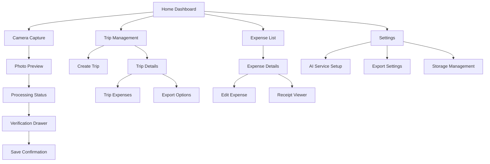
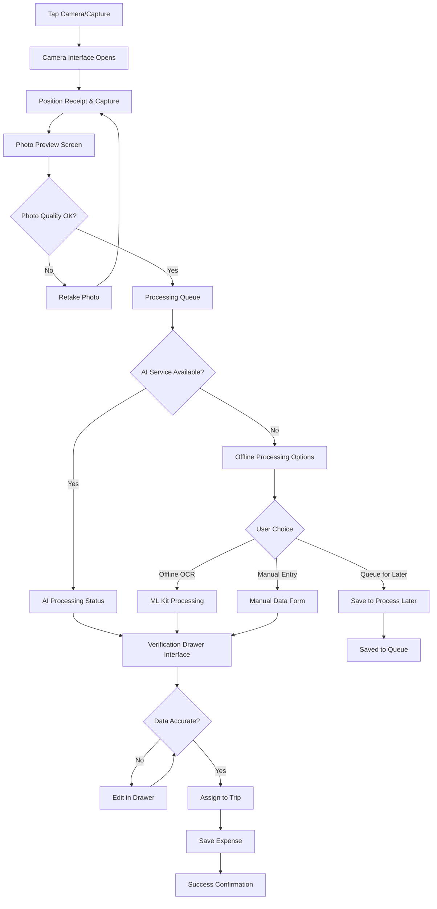
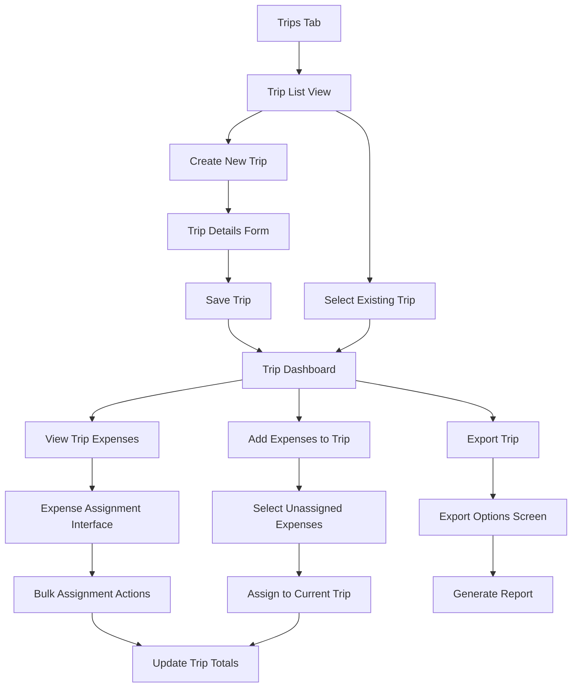

# Business Expense Tracker UI/UX Specification

## Introduction

This document defines the user experience goals, information architecture, user flows, and visual design specifications for the Business Expense Tracker's mobile interface. It serves as the foundation for visual design and frontend development, ensuring a cohesive and user-centered experience for business travelers capturing and managing expenses on mobile devices.

### Overall UX Goals & Principles

#### Target User Personas

**Primary: Frequent Business Travelers**
Technical professionals who travel 1-4 times monthly, handling 10-50 expense items per trip. Currently struggle with manual expense reporting and receipt management during travel.

**Secondary: Occasional Business Travelers**  
Professionals traveling quarterly or less, needing simple expense documentation for reimbursement. Require intuitive interface that doesn't demand expense reporting expertise.

#### Usability Goals

- **Quick Capture**: Receipt to verified data in under 30 seconds
- **Offline Reliability**: Full functionality without connectivity during travel
- **Trust Building**: AI extraction accuracy immediately verifiable by users
- **Gesture Fluency**: Native mobile interactions for all primary workflows
- **Error Recovery**: Clear paths when AI processing fails or connectivity issues occur

#### Design Principles

1. **Mobile-First Gestures** - All interactions optimized for touch and swipe patterns
2. **Immediate Feedback** - Every action provides instant visual confirmation
3. **Graceful Degradation** - Smooth transitions between AI, offline OCR, and manual entry
4. **Trust Through Transparency** - Always show data source and confidence levels
5. **Traveler-Centric Organization** - Trip-based mental model matches user workflows

#### Change Log
| Date | Version | Description | Author |
|------|---------|-------------|--------|
| 2025-01-15 | 1.0 | Initial UI/UX specification | UX Expert Sally |

## Information Architecture (IA)

### Site Map / Screen Inventory

### Navigation Structure

**Primary Navigation**: Bottom tab bar with four main sections:
- Home (expense overview and quick capture)
- Trips (trip management and organization)
- Expenses (all expenses list and search)
- Settings (AI configuration and preferences)

**Secondary Navigation**: Context-aware top navigation within each section:
- Back buttons for hierarchical navigation
- Action buttons (edit, export, delete) in top right
- Search and filter controls where applicable

**Breadcrumb Strategy**: Minimal breadcrumbs due to mobile space constraints. Clear hierarchical back navigation with screen titles indicating current location.

## User Flows

### Receipt Capture and Verification Flow

**User Goal:** Capture receipt photo and verify extracted expense data for accuracy

**Entry Points:** 
- Camera button from home dashboard
- Quick capture from trip details screen
- Add expense button from expense list

**Success Criteria:** Expense saved with verified data and receipt image stored locally

#### Flow Diagram

#### Edge Cases & Error Handling:
- Camera permission denied: Clear instructions with settings navigation
- Poor photo quality: Automatic quality detection with retake prompts
- AI service rate limits: User notification with offline processing option
- Network connectivity loss: Seamless transition to offline queue
- Invalid extracted data: Validation errors with clear correction guidance

**Notes:** The slider/drawer verification interface is central to this flow, allowing users to maintain full receipt visibility while reviewing and editing extracted data.

### Trip Management and Organization Flow

**User Goal:** Create business trip and assign expenses for organized reporting

**Entry Points:**
- Trips tab from main navigation
- Create trip from expense assignment screen
- Duplicate existing trip

**Success Criteria:** Trip created with assigned expenses ready for export

#### Flow Diagram

#### Edge Cases & Error Handling:
- Trip date conflicts: Validation with clear date range guidance
- Unassigned expenses: Prominent notification with quick assignment
- Empty trip export: Warning with option to add expenses first
- Storage limits: Trip archival suggestions with data management

**Notes:** Trip-centric organization matches business traveler mental models and supports the export workflow requirements.

## Wireframes & Mockups

### Design Files

**Primary Design Files:** Will be created in Figma for detailed visual specifications and developer handoff

### Key Screen Layouts

#### Receipt Verification Screen with Slider Drawer

**Purpose:** Core verification interface where users confirm AI-extracted data using the sliding drawer overlay

**Key Elements:**
- Full-screen receipt image as background with zoom/pan capabilities
- Bottom sliding drawer containing extracted data fields
- Drag handle for drawer positioning control
- Processing status indicator (AI service, offline OCR, or manual entry)
- Edit mode toggle for data field modifications
- Save/Cancel action buttons in drawer footer

**Interaction Notes:** 
- Drawer slides up from bottom with spring animation
- Users can drag to any position between collapsed (showing only totals) and expanded (full form)
- Tapping receipt image when drawer is expanded dims drawer for better receipt visibility
- Swipe gestures for drawer positioning with momentum and snap points

#### Trip Dashboard Screen

**Purpose:** Central hub for trip management showing expense summaries and quick actions

**Key Elements:**
- Trip header with name, dates, and destination
- Expense summary cards (total, by category, tax breakdown)
- Recent expenses list with thumbnail receipt images
- Floating action button for adding expenses to current trip
- Export button prominently displayed when trip has expenses
- Archive/complete trip option in overflow menu

**Interaction Notes:**
- Pull-to-refresh for expense list updates
- Swipe actions on expense items for quick edit/delete
- Tap expense items to view full verification screen
- Export button animates with processing status

#### Camera Capture Interface

**Purpose:** Optimized receipt photo capture with quality guidance

**Key Elements:**
- Full-screen camera viewfinder with receipt framing guide
- Auto-focus indicator and exposure controls
- Capture button with haptic feedback
- Switch camera button for front/back camera selection
- Gallery button for selecting existing photos
- Flash toggle and quality settings

**Interaction Notes:**
- Tap to focus with visual feedback ring
- Volume buttons as alternative capture triggers
- Automatic receipt detection with overlay guide
- Immediate photo preview with retake/accept options

**Design File Reference:** figma.com/expense-tracker-wireframes (to be created)

## Component Library / Design System

### Design System Approach

**Design System Approach:** Create custom component library optimized for expense tracking workflows with React Native implementation

### Core Components

#### Sliding Drawer Component

**Purpose:** Primary verification interface for AI-extracted data with gesture-based positioning

**Variants:** 
- Collapsed (summary view showing totals only)
- Partial (key fields visible with scroll for details)
- Expanded (full form with all editable fields)

**States:**
- Processing (loading indicators with AI service status)
- Ready (data loaded, ready for verification)
- Editing (active field modification mode)
- Error (validation errors or processing failures)

**Usage Guidelines:** Central component for data verification workflow. Drawer positioning should feel natural with spring animations and magnetic snap points at 25%, 50%, and 90% screen height.

#### Receipt Image Viewer

**Purpose:** Full-screen receipt display with zoom/pan capabilities and overlay compatibility

**Variants:**
- Standard view (full receipt with overlay support)
- Zoom mode (detailed section viewing)
- Comparison view (side-by-side for duplicate detection)

**States:**
- Loading (image processing with skeleton placeholder)
- Loaded (interactive image with gesture controls)
- Error (failed load with retry options)

**Usage Guidelines:** Must support drawer overlay without gesture conflicts. Pinch-to-zoom and pan gestures should not interfere with drawer positioning.

#### Trip Summary Card

**Purpose:** Dashboard component showing trip overview with expense totals and status

**Variants:**
- Active trip (current/upcoming with add expense actions)
- Completed trip (archived with export focus)
- Empty trip (no expenses with guidance prompts)

**States:**
- Syncing (processing queue updates)
- Complete (all data current)
- Attention needed (missing data or validation issues)

**Usage Guidelines:** Consistent card design across trip list and dashboard views. Visual hierarchy emphasizes total amounts and export readiness.

## Branding & Style Guide

### Visual Identity

**Brand Guidelines:** Custom branding for professional business expense application

### Color Palette

| Color Type | Hex Code | Usage |
|------------|----------|--------|
| Primary | #2563EB | Primary actions, drawer headers, active states |
| Secondary | #64748B | Secondary text, inactive elements |
| Accent | #10B981 | Success states, completed expenses, verified data |
| Success | #059669 | Positive feedback, successful processing |
| Warning | #D97706 | Attention needed, validation warnings |
| Error | #DC2626 | Errors, failed processing, critical alerts |
| Neutral | #F8FAFC, #E2E8F0, #475569 | Backgrounds, borders, secondary text |

### Typography

#### Font Families
- **Primary:** SF Pro (iOS) / Roboto (Android) - System fonts for native feel
- **Secondary:** SF Pro Display / Roboto Medium - Headers and emphasis
- **Monospace:** SF Mono / Roboto Mono - Currency amounts and data

#### Type Scale
| Element | Size | Weight | Line Height |
|---------|------|--------|-------------|
| H1 | 28pt | Bold | 1.2 |
| H2 | 22pt | Semibold | 1.3 |
| H3 | 18pt | Semibold | 1.4 |
| Body | 16pt | Regular | 1.5 |
| Small | 14pt | Regular | 1.4 |

### Iconography

**Icon Library:** React Native Vector Icons (Feather set for consistent line style)

**Usage Guidelines:** 24pt icons for primary actions, 16pt for secondary elements. Consistent stroke width and corner radius for visual harmony.

### Spacing & Layout

**Grid System:** 8pt grid system for consistent spacing and alignment

**Spacing Scale:** 4pt, 8pt, 12pt, 16pt, 24pt, 32pt, 48pt, 64pt for margins, padding, and component spacing

### Dark Mode Color Palette for Low-Light Travel Conditions

Business travelers frequently work in low-light environments - airplane cabins, hotel rooms, early morning airports, and late evening travel. A well-designed dark mode reduces eye strain and preserves battery life during extended travel periods.

#### Dark Mode Color Palette

| Color Type | Dark Mode Hex | Light Mode Hex | Usage |
|------------|---------------|----------------|--------|
| Primary | #3B82F6 | #2563EB | Brighter blue for visibility on dark backgrounds |
| Secondary | #94A3B8 | #64748B | Lighter gray for better contrast |
| Accent | #34D399 | #10B981 | Slightly brighter green for dark backgrounds |
| Success | #10B981 | #059669 | Enhanced visibility for success states |
| Warning | #F59E0B | #D97706 | Warmer amber for dark mode compatibility |
| Error | #EF4444 | #DC2626 | Slightly brighter red for visibility |
| Background Primary | #0F172A | #FFFFFF | Deep slate for primary backgrounds |
| Background Secondary | #1E293B | #F8FAFC | Elevated surface color |
| Background Tertiary | #334155 | #E2E8F0 | Cards and drawer backgrounds |
| Text Primary | #F1F5F9 | #1E293B | High contrast for body text |
| Text Secondary | #CBD5E1 | #475569 | Secondary information text |
| Border | #475569 | #E2E8F0 | Subtle borders and dividers |

#### Dark Mode Specific Considerations

**Receipt Image Visibility**: Dark drawer overlays with semi-transparent backgrounds ensure receipt content remains visible. Background opacity reduced to 0.85 in dark mode vs 0.92 in light mode.

**AI Processing Status**: Enhanced visual feedback with subtle glow effects around processing indicators to improve visibility in dark environments.

**Currency and Numbers**: Monospace fonts with increased letter spacing in dark mode for better readability of financial data.

**Gesture Feedback**: Subtle haptic feedback combined with brief highlight animations help users navigate drawer positioning in low-light conditions.

#### Implementation Strategy

**Automatic Mode Switching**: Follows system dark mode preferences by default with manual override option in settings.

**Smooth Transitions**: Color transitions animated over 200ms when switching between modes to prevent jarring visual changes.

**Testing Requirements**: All interface elements tested at minimum brightness levels common during air travel and hotel usage.

## Accessibility Requirements

### Compliance Target

**Standard:** WCAG 2.1 AA compliance with mobile-specific accessibility enhancements

### Key Requirements

**Visual:**
- Color contrast ratios: 4.5:1 minimum for normal text, 3:1 for large text and UI components
- Focus indicators: 2pt minimum outline with high contrast colors around interactive elements
- Text sizing: Support for 200% zoom without horizontal scrolling, dynamic type scaling

**Interaction:**
- Keyboard navigation: Full app functionality accessible via external keyboard (accessibility services)
- Screen reader support: VoiceOver (iOS) and TalkBack (Android) with semantic labels and hints
- Touch targets: 44pt minimum touch target size for all interactive elements

**Content:**
- Alternative text: Descriptive alt text for receipt images and status icons
- Heading structure: Logical heading hierarchy for screen reader navigation
- Form labels: Clear association between form labels and input fields

### Testing Strategy

Screen reader testing on both iOS and Android devices, color blindness simulation for interface elements, and motor accessibility testing for drawer gesture interactions with assistive touch enabled.

## Responsiveness Strategy

### Breakpoints

| Breakpoint | Min Width | Max Width | Target Devices |
|------------|-----------|-----------|----------------|
| Mobile | 320px | 767px | iPhone SE to standard smartphones |
| Tablet | 768px | 1023px | iPad and Android tablets |
| Desktop | 1024px | 1439px | iPad Pro landscape, small laptops |
| Wide | 1440px | - | Large tablets, desktop environments |

### Adaptation Patterns

**Layout Changes:** Drawer component scales proportionally to screen height, maintaining optimal gesture zones. Larger screens show more expense list items without pagination.

**Navigation Changes:** Tablet layouts may show persistent trip sidebar alongside main content. Desktop views optimize for mouse interaction while maintaining touch compatibility.

**Content Priority:** Smaller screens prioritize recent expenses and current trip. Larger screens can display expense history and multiple trip overviews simultaneously.

**Interaction Changes:** Drawer snap points adjust based on screen height ratios. Larger screens enable keyboard shortcuts for power users.

## Animation & Micro-interactions

### Motion Principles

Smooth, purposeful animations that provide clear feedback without delaying task completion. All animations respect system accessibility settings for reduced motion.

### Key Animations

- **Drawer Slide Animation:** Spring animation with 0.3s duration, easeOutCubic easing for natural feel
- **Processing Status:** Subtle pulse animation during AI processing (Duration: 1.5s, Easing: easeInOut)
- **Success Confirmation:** Check mark animation with scale and fade (Duration: 0.5s, Easing: easeOutBack)
- **Photo Capture:** Shutter animation with haptic feedback (Duration: 0.2s, Easing: linear)
- **Error States:** Gentle shake animation for validation errors (Duration: 0.4s, Easing: easeInOut)

## Performance Considerations

### Performance Goals

- **Page Load:** Initial app launch under 3 seconds on average devices
- **Interaction Response:** Drawer positioning responds within 16ms for 60fps smoothness
- **Animation FPS:** Maintain 60fps for all drawer animations and transitions

### Design Strategies

Optimize image compression for receipt photos, lazy load expense list items, and use React Native's built-in performance optimizations for smooth scrolling and gesture handling.

## Next Steps

### Immediate Actions

1. Create detailed mockups in Figma with drawer interaction specifications
2. Design component library with gesture interaction patterns
3. Validate accessibility compliance with mobile screen reader testing
4. Create animation specifications for developer implementation

### Design Handoff Checklist

- [x] All user flows documented
- [x] Component inventory complete  
- [x] Accessibility requirements defined
- [x] Responsive strategy clear
- [x] Brand guidelines incorporated
- [x] Performance goals established